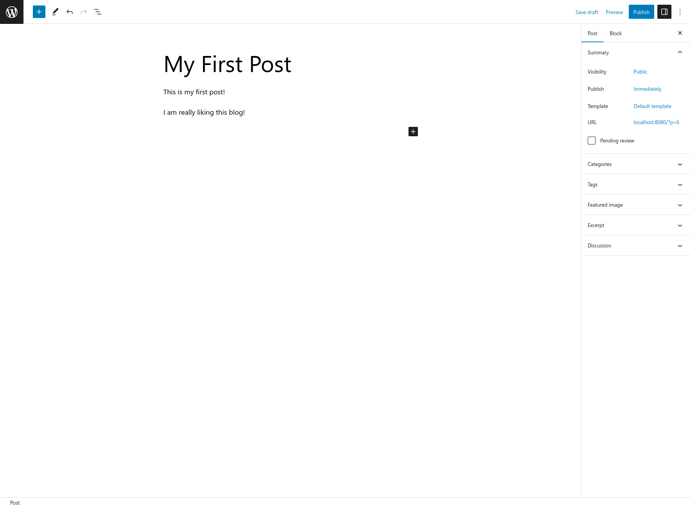
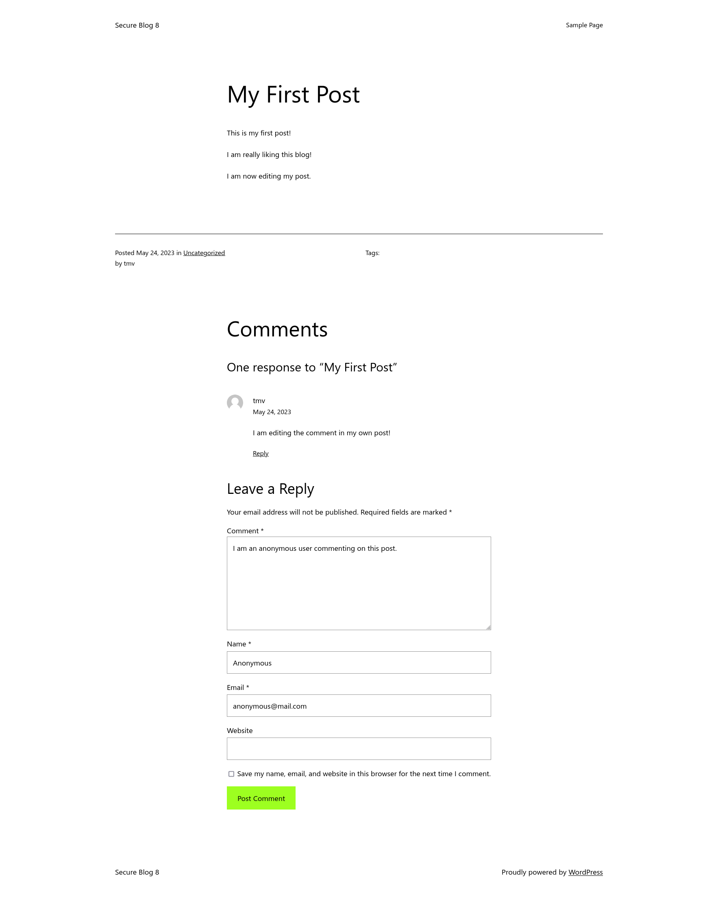
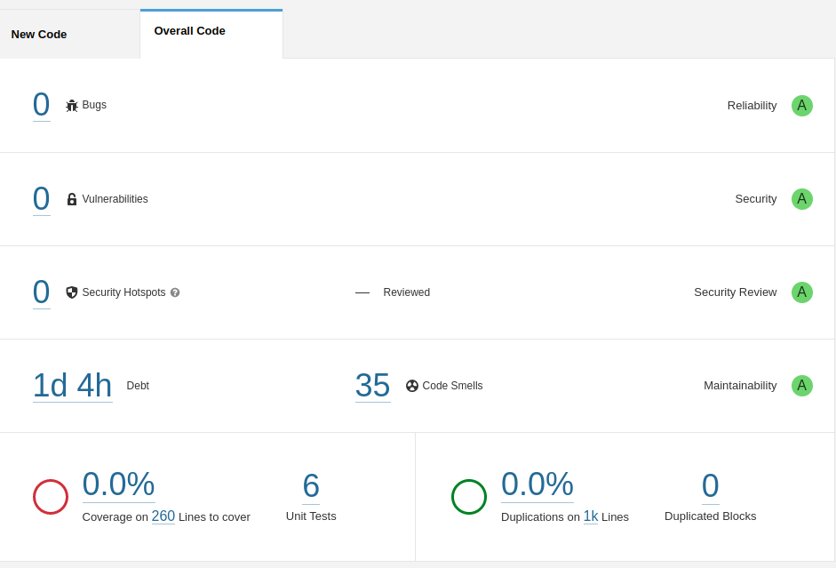

# Project Report

The project's goal is to design and implement a secure blog platform.
The blog should resist common security threats, such as SQL injection, cross-site scripting (XSS), cross-site request
forgery (CSRF), and denial of service (DoS).
To do this, multiple security measures should be implemented, such as authentication and authorization, data protection,
and secure communication.

## Design

### System Architecture

The secure blog platform can be designed into three main components.

First, the client - a web application - provides a user-friendly interface for interacting with the platform.
The client also contains an authentication module, handling user authentication requests.

Second, the server - a REST API - provides the main functionality of the platform, such as creating and editing posts.
It receives and processes the requests from the clients, interacting with the database and enforcing business logic.
The server relies on a database to store user information, as well as the posts and comments.

Third, the platform relies on external services.
One of them is an authentication service to handle user authentication, providing secure authentication tokens and
session management.
Another is a content delivery network (CDN) to store and serve static assets, such as images, CSS and JavaScript files.

### System Actors

The system actors are the users.
There are two types of users: authenticated users and unauthenticated users.

Authenticated users are users that have logged in to the platform, and have access to their personal content management
services.
Some authenticated users are authors, which have additional privileges, such as editing and deleting their own posts, as
well as managing their comments.

Unauthenticated users are users that have not logged in to the platform, but can still access public content and comment
on posts.

### System Use Cases

1. User Registration
    - **Description:** A user can register to the platform, providing a username, an email and a password.
    - **Actors:** Unauthenticated User
    - **Preconditions:** The user is not logged in.
    - **Postconditions:** The user is registered and logged in.
2. User Login
    - **Description:** A user can log in to the platform, providing their email and password.
    - **Actors:** Unauthenticated User
    - **Preconditions:** The user is not logged in.
    - **Postconditions:** The user is logged in.
3. Create Post
    - **Description:** An authenticated user can create a post, providing a title and a body.
    - **Actors:** Authenticated User
    - **Preconditions:** The user is logged in.
    - **Postconditions:** A new post is created.
4. Edit Post
    - **Description:** A post's author can edit a post, providing a new title and/or a new body.
    - **Actors:** Authenticated User
    - **Preconditions:** The user is logged in and is the author of the post.
    - **Postconditions:** The post is updated.
5. Change Post's Status
    - **Description:** A post's author can change the state of a post, publishing or marking it as a draft.
    - **Actors:** Authenticated User
    - **Preconditions:** The user is logged in and is the author of the post.
    - **Postconditions:** The post's status is changed.
6. Delete Post
    - **Description:** A post's author can delete a post.
    - **Actors:** Authenticated User
    - **Preconditions:** The user is logged in and is the author of the post.
    - **Postconditions:** The post is deleted.
7. Create Comment
    - **Description:** A user can create a comment on a post, providing a body.
    - **Actors:** User
    - **Preconditions:** None.
    - **Postconditions:** A new comment is created.
8. Edit Comment
    - **Description:** A post's author can edit a comment, providing a new body.
    - **Actors:** Authenticated User
    - **Preconditions:** The user is logged in and is the author of the post.
    - **Postconditions:** The comment is updated.
9. Delete Comment
    - **Description:** An authenticated user can delete a comment.
    - **Actors:** Authenticated User
    - **Preconditions:** The user is logged in and is the author of the post.
    - **Postconditions:** The comment is deleted.

### System Security Assumptions

1. Authentication and Authorization
    - **Description:** The system's authentication and authorization services are secure.
    - **Rationale:** The system relies on an external authentication service to handle user authentication and
      authorization.
      This service is assumed to be secure, and therefore the system can rely on it to provide secure authentication
      tokens and session management.
2. Data Protection
    - **Description:** The system's data is protected from unauthorized access or modification.
    - **Rationale:** To be secure, the system must protect its data from unauthorized access or modification.
      This is achieved by encrypting the data at rest, as well as encrypting the data in transit. It must properly
      validate and sanitize all user inputs, to prevent malicious input from being stored in the database.
3. Secure Communication
    - **Description:** The system's communication channels are secure.
    - **Rationale:** To be secure, the system must ensure that all communication channels are secure.
      This is achieved by using HTTPS to encrypt all communication between the client and the server.

### System Security Threats

1. Authentication and Authorization: possible attacks on the authentication and authorization services include brute
   force attacks, session hijacking, and session fixation.
2. Data Protection: possible attacks on the data include SQL injection, cross-site scripting (XSS), and cross-site
   request forgery (CSRF), as well as insecure direct object references.
3. Denial of Service: possible attacks include denial of service (DoS) and distributed denial of service (DDoS). These
   attacks may overload the system's resources, preventing legitimate users from accessing the system.
4. Insecure Communication: malicious users may try to intercept the communication between the client and the server (
   Man-in-the-Middle attack) or eavesdrop on the communication (eavesdropping attack).

## Implementation

For the implementation, we chose an innovative approach.
We started by implementing the server and the client from scratch, putting security first.
In the end, we achieved a secure platform, but with limited functionality.

To investigate what we could do to improve the platform, we decided to use a popular blogging platform as a reference (
WordPress).

### Our Platform

Our implementation uses an architecture based on microservices, with Java Spring Boot for the server, Keycloak for the
authentication service, and Flutter for the client.
We chose these technologies because they offer a robust development environment, supporting security, transaction
control and integration with other services.

Spring allowed us to expose a REST API, which is used by the client to communicate with the server.
It greatly simplifies the development of the server by providing a rich set of tools and libraries.

Keycloak allowed us to implement a secure authentication service based on tokens, allowing granular access control and
protecting confidential information.

Finally, Flutter allowed us to develop a cross-platform mobile application, which can be used by the users to access the
platform.
It is a flexible and modern framework, which allows for the development of beautiful and responsive applications.

We implemented a content-management system, where users can create posts, change their status, and manage their
comments.

The blog supports multiple users, each with their own posts and comments.
Users can register and log in to the platform, and only users with proper authorization can modify their content.

The pictures below show the main aspects of the platform's implementation, as well as information about the endpoints.

---

Our implementation followed best practices for software development, including the use of version control, testing, and
adequate cryptography.
We ensured proper granular access control, with different roles for different users, ensuring that only authorized users
can perform certain actions.

### WordPress

To deploy the platform, we used Docker with the docker-compose.yml file available
at [Dockerhub](https://hub.docker.com/_/wordpress).

After choosing the language, our next step was to choose the blog name, as well as the username and password for the
admin user.
We took care to choose a different username than the traditional `admin` to make it harder for attackers to guess the
username in a brute force attack.
We also chose a strong password, with a mix of uppercase and lowercase letters, numbers and symbols.

We were then redirected to the login page, where we logged in with the admin user.

After logging in, we were redirected to the dashboard, where we could manage our blog.

Keeping security at the front, we immediately decided to install plugins to improve the security of the platform.

Our first choice was a plugin for two-factor authentication:

We ran through the installation process, and were able to configure the plugin to use the Google Authenticator app on a
mobile device, as well as print backup codes.

Click to expand

Next, we installed a plugin to improve the security of the login page by limiting the number of login attempts.

Again, we ran through the installation process, and were able to configure the plugin to limit the number of login
attempts.

Click to expand

To keep the login page secure, we also installed a plugin to force a password policy.
The installation process was similar to the previous plugins, and we were able to configure the plugin to force a strong
password policy, as well as a password expiration policy.

Click to expand

Finally, we installed a plugin to use Google's reCAPTCHA service to protect the forms on the website from spam and bots.

Click to expand

To ensure that registration is only possible with a valid email address, we installed a plugin to send confirmation
emails:

Again, we ran through the installation process, and were able to configure the plugin to send confirmation emails.

Click to expand

We wanted to go further with security, namely regarding HTTPS.
However, generating trusted certificates is a complex process, and we opted to ignore this.

After we were satisfied with the security of the platform, we decided to register a user account to test the platform.
We were able to register an account, and were sent a confirmation email allowing us to choose a password.

---

---

Then, we were able to log in with our new account.

Afterward, we were redirected to the dashboard, where we could see information about our account and the website.

Our next step was to create a new post.

We saved the post as a draft, and then published it.

---

---

We were then able to view the post on the website.

And add a comment to the post.

---

We edited our comment:

---

And our post:

---

---

Finally, we logged out of our account and commented on the post as an anonymous user.

---

## Analysis

### Our Platform

We took several steps to ensure the security of our platform.

The server framework and programming languages are memory-safe, secure, has a long track record, and is widely used in
the industry due to its speed.

The authentication module supports single sign-on, allowing users to log in to multiple services with a
single set of credentials.
It also allows for the integration of external authentication providers, such as Google and
Facebook or federated authentication providers, such as SAML and OpenID Connect.

Finally, the client framework was developed by Google, and it is widely used in the industry, making it a good choice
for the client.
As it has broad support, it is secure, and it is constantly being updated to fix any security issues.

During the development, we used the OWASP Top 10 as a reference, to ensure that we were following best practices for web
security.

We kept secure design principles in mind, such as the principle of least privilege, and the principle of defense in
depth.
We validated all user inputs, and sanitized it before using it.

Our dependencies were kept up-to-date, and we used only dependencies that were actively maintained and had a large user
base.
We also used a dependency scanner to identify any known vulnerabilities in our dependencies.

To deal with the most common vulnerabilities, we used a Content Security Policy to prevent cross-site scripting.

We also routinely analyzed our code to ensure correct functionality, as well as to identify possible vulnerabilities.
For that, we used static code analysis tools, such as SonarLint and SonarQube, as well as dynamic code analysis tools,
such as OWASP ZAP.

The pictures below show the evolution of our code's security rating, as we fixed the issues identified by SonarLint
and SonarQube.

---

---

---

We also attempted to analyze our code in a penetration testing mindset using tools such as sqlmap for SQL injection,
subfinder for subdomain enumeration and path traversal, and nmap for port scanning.
To identify problems with dependencies, we used wappalyzer and nuclei to identify the technologies used and possible
vulnerabilities.

After this analysis, we were confident that our platform was secure.
We must, however, note that security is a continuous process, and that we must always be vigilant for new
vulnerabilities.
Software must be continuously updated to fix any vulnerabilities that may be discovered.

### WordPress

WordPress is a very popular platform for creating websites, and is used by many large companies and organizations.

Development is open-source, and it is constantly being updated to fix any security issues that may be discovered.
It has a dedicated security team that is responsible for identifying and fixing any security issues, and is regularly
updated and audited by security researchers.

Care is taken to ensure granular access control and permissions both in access to the platform and in the files and
folders used.

Finally, there are guidelines for plugin and theme developers to ensure that their code is secure, and plugins are
reviewed and rated by the community.

As we used a recent version and augmented the security of the platform through state-of-the art authentication and
protection mechanisms, we believe that our WordPress deployment is secure.

Because we are aware that some themes and plugins are not secure, we only installed plugins and themes that were
actively maintained, had a large number of users, and were compatible with the latest version of WordPress.
More than that, we opted to avoid installing plugins and themes that were not necessary for our platform, as they could
be a source of vulnerabilities.

By combining WordPress's inherent security with our own security measures, we believed that our WordPress deployment
would be
secure.

Nevertheless, we decided to analyze our WordPress deployment using OWASP ZAP, to identify any vulnerabilities that we
may have missed.

We also chose to perform more manual tests using sqlmap and nuclei, to identify any vulnerabilities that may be present
both in the WordPress code and in its dependencies.

Finally, we used a tool specifically designed to identify vulnerabilities in WordPress, called WPScan.

This process turned up a few minor issues, some of which were false positives, and some of which were not exploitable.

In the end, our confidence in the security of our WordPress deployment was reinforced, showing the importance of using a
combination of security by design and adequate testing to ensure the security of a platform.

## Conclusion

This project allowed us to apply what we learned about application and web security in practice.

We understood the importance of keeping security in mind from the very beginning of the development process and how to
do so.

Finally, we learned how to use tools to analyze our code and identify possible vulnerabilities, as well as how to fix or
mitigate them.

By deploying an implementation of a popular platform, we were able to understand how to secure it, and how to use
plugins to augment its security.
We were also able to understand the importance of keeping the platform and its plugins up-to-date and how hard it is to
evaluate the security of a platform with a large code base and many dependencies.

In the end, we found it much easier to justify the security of our own platform, and concluded that more features mean
a larger attack surface, and thus more possible vulnerabilities.