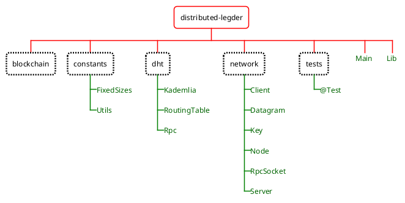

# Distributed Legder

Requisitos e estrutura da rede distribuida

### BootStrap Nodes
Entrypoint to the network

### Project Structure

```puml

@startwbs

<style>
wbsDiagram {
  // all lines (meaning connector and borders, there are no other lines in WBS) are black by default
  Linecolor black
  arrow {
    // note that connector are actually "arrow" even if they don't look like as arrow
    // This is to be consistent with other UML diagrams. Not 100% sure that it's a good idea
    // So now connector are green
    LineColor green
  }
  :depth(0) {
      // will target root node
      BackgroundColor White
      RoundCorner 10
      LineColor red
      // Because we are targetting depth(0) for everything, border and connector for level 0 will be red
  }
  arrow {
    :depth(2) {
      // Targetting only connector between Mexico-Chihuahua and USA-Texas
      LineColor blue
      LineStyle 4
      LineThickness .5
    }
  }
  node {
    :depth(1) {
   
      RoundCorner 10
      LineStyle 2
      LineThickness 2.5
      BackgroundColor White
    }
  }
  boxless {
    // will target boxless node with '_'
    FontColor darkgreen
  }  
}
</style>

+ distributed-legder
++ blockchain
++ constants
+++_ FixedSizes
+++_ Utils
++  dht
+++_ Kademlia
+++_ RoutingTable
+++_ Rpc
++  network
+++_ Client
+++_ Datagram
+++_ Key
+++_ Node
+++_ RpcSocket
+++_ Server
++  tests
+++_ @Test
++_ Main
++_ Lib
@endwbs

```

### Diagrama de classes da rede distribuida

